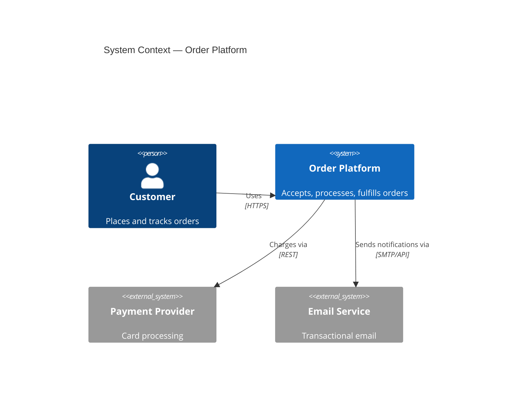
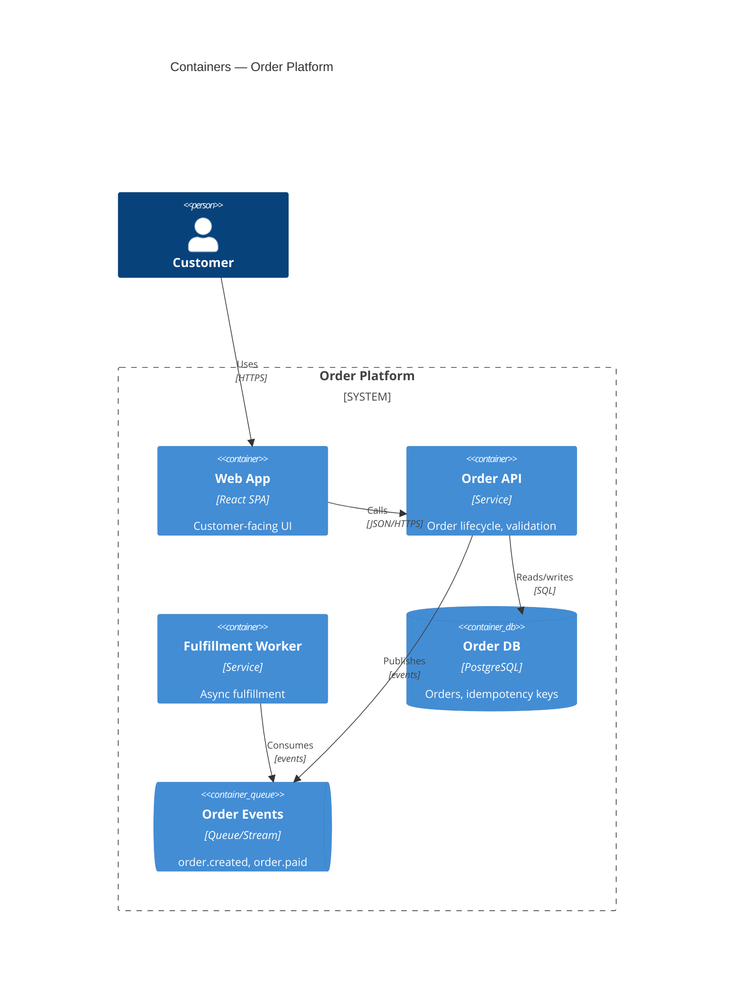

# C4 Diagrams in Mermaid

C4 is a zoom hierarchy: Context → Container → Component → Code. This skill
produces the first three; never produce Code-level diagrams (they rot
instantly — the code is the diagram).

## Which levels to produce

| Situation | Levels |
|---|---|
| Any design task | L1 Context (always) |
| Multi-service / multi-process design | + L2 Container |
| One container carries the riskiest decisions | + L3 Component for that container ONLY |

Do not diagram every container at L3. Diagram the one whose internal
structure an ADR actually argues about.

## L1 — System Context

Shows: the system as one box, its users, and external systems. Answers:
"what is this and who/what talks to it?"

## L2 — Container

Shows: deployable/runnable units (services, SPAs, databases, queues) and
the protocols between them. Every arrow gets a label AND a protocol.

If `C4Container` syntax is unsupported in the rendering target, fall back to
`flowchart LR` with subgraphs — keep the same information density.

## L3 — Component (riskiest container only)

Shows: the major internal parts of ONE container and their responsibilities.
Map components to the layering rules in the pattern catalog (e.g., domain
core does not import adapters).

## Diagram rules

1. Every element: name + technology + one-line responsibility.
2. Every arrow: verb + protocol/mechanism. "Uses" alone is banned.
3. Sync vs async must be visually or textually distinguished.
4. One diagram = one level. Mixed-zoom diagrams are rejected in review.
5. Diagrams live next to the ADR that motivated them and are updated in the
   same commit as the change they describe.
6. If a diagram needs a legend longer than three lines, the design is too
   tangled — simplify the design, not the legend.
